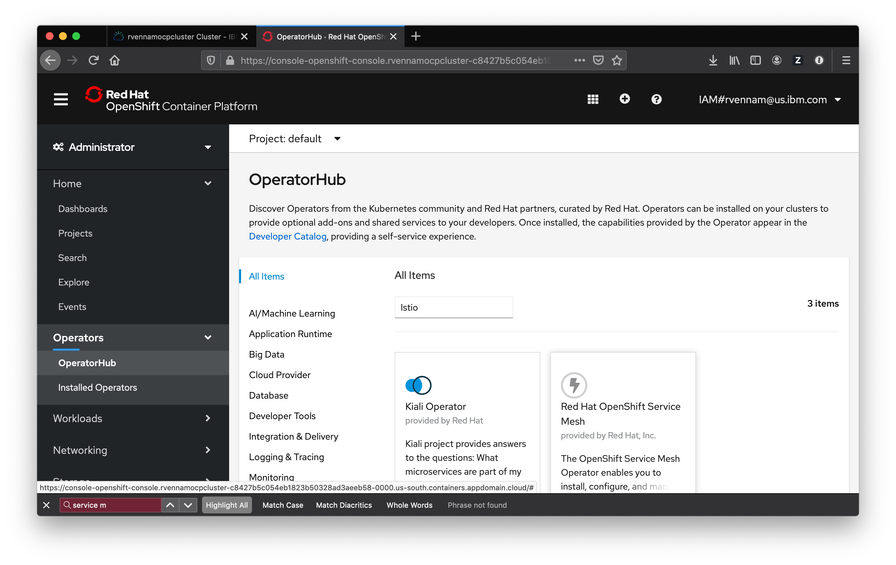

# Exercise 2 - Installing Istio on IBM Cloud Kubernetes Service

## Install the Operator

  
1. Navigate to your cluster in the [IBM Cloud Dashboard](https://cloud.ibm.com/kubernetes/clusters)

2. Click on your cluster and Launch **OpenShift web console**

3. Select **Administrator** in the drop down and then select **Operators** -> **OperatorHub**

4. Search for *Service Mesh* and select **Red Hat OpenShift Service Mesh**

5. Click **Install** and then **Subscribe**

6. Click on **Installed Operators** and refresh the page to see the changes.

## Deploying the Red Hat OpenShift Service Mesh control plane

1.  Create a new project by going to **Home** -> **Projects** -> **Create Project**
2.  Enter `istio-system` in the **Name** and click **Create**
3.  Navigate to **Operators** -> **Installed Operators**
4.  Click the **Red Hat OpenShift Service Mesh Operator**. 
5.  Under **Istio Service Mesh Control Plane** click **Create Instance**.
6.  Then, click **Create**. The Operator creates Pods, services, and Service Mesh control plane components based on your configuration parameters.

### Create a ServiceMeshMemberRoll
ServiceMeshMemberRoll resource is used to to specify the namespaces associated with the Service Mesh.

1. Navigate to **Operators** → **Installed Operators** again.
2. Click the **Red Hat OpenShift Service Mesh Operator**.
3. Under **Istio Service Mesh Member Roll** click **Create Instance**
4. Change `your-project` to `bookinfo` and delete the last line.
5. Then, click **Create**. 
    
Congratulations! You successfully installed Istio into your cluster and configured the `bookinfo` project to use it.

#### [Continue to Exercise 3 - BookInfo](../exercise-3/README.md)
