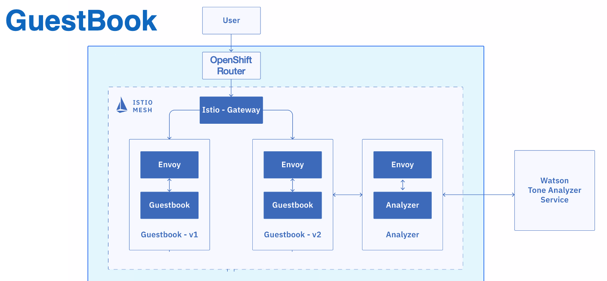

# Exercise 4 - Expose the app with the Istio Ingress Gateway and Route

The components deployed on the service mesh by default are not exposed outside the cluster. External access to individual services so far has been provided by creating an external load balancer or node port on each service.

An Ingress Gateway resource can be created to allow external requests through the Istio Ingress Gateway to the backing services.



### Expose the BookInfo app with Ingress Gateway

1. Configure the bookinfo default route with the Istio Ingress Gateway. 

    ```shell
    oc create -f bookinfo/bookinfo-gateway.yaml
    ```

2. Get the **ROUTE** of the Istio Ingress Gateway.

    ```shell
    oc get routes -n istio-system istio-ingressgateway
    ```
    Output:
    ```shell
    NAME                   HOST
istio-ingressgateway   istio-ingressgateway-istio-system.rvennamocpcluster-c8427b5c054eb1823b50328ad3aeeb58-0000.us-south.containers.appdomain.cloud
    ```

1. Make note of the HOST address that you retrieved in the previous step, as it will be used to access the BookInfo app in later parts of the course. Create an environment variable called $INGRESS_HOST with your address.

Example:
```
export INGRESS_HOST=istio-ingressgateway-istio-system.rvennamocpcluster-c8427b5c054eb1823b50328ad3aeeb58-0000.us-south.containers.appdomain.cloud
```

Congratulations! You extended the base Ingress features by providing a DNS entry to the Istio service.

Visit the application by going to http://<INGRESS_HOST>/productpage in a new tab.

## References:
[Kubernetes Ingress](https://kubernetes.io/docs/concepts/services-networking/ingress/)
[Istio Ingress](https://istio.io/docs/tasks/traffic-management/ingress.html)
[Bring your own ALB](https://www.ibm.com/blogs/bluemix/2019/04/bring-your-own-alb-dns-with-health-checks-and-ssl-certificates-beta/)

#### [Continue to Exercise 5 - Traffic Management](../exercise-5/README.md)