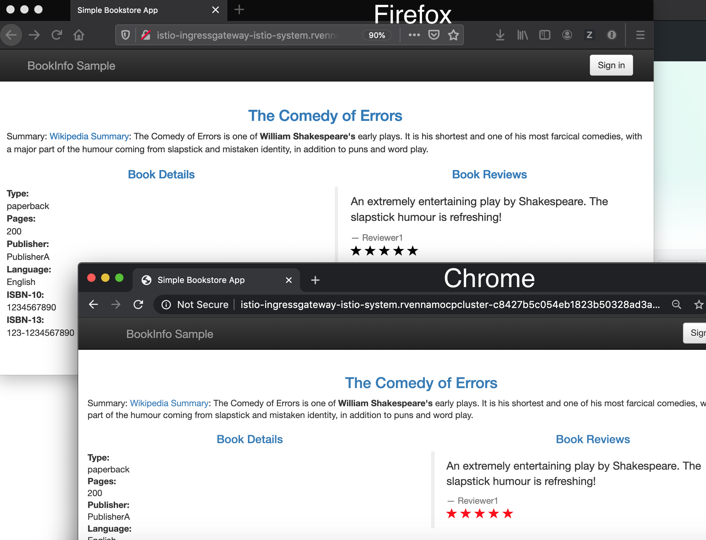

# Exercise 6 - Perform traffic management

## Using rules to manage traffic
The core component used for traffic management in Istio is Pilot, which manages and configures all the Envoy proxy instances deployed in a particular Istio service mesh. It lets you specify what rules you want to use to route traffic between Envoy proxies, which run as sidecars to each service in the mesh. Each service consists of any number of instances running on pods, containers, VMs etc. Each service can have any number of versions (a.k.a. subsets). There can be distinct subsets of service instances running different variants of the app binary. These variants are not necessarily different API versions. They could be iterative changes to the same service, deployed in different environments (prod, staging, dev, etc.). Pilot translates high-level rules into low-level configurations and distributes this config to Envoy instances. Pilot uses three types of configuration resources to manage traffic within its service mesh: Virtual Services, Destination Rules, and Service Entries.

### Virtual Services
A [VirtualService](https://istio.io/docs/reference/config/istio.networking.v1alpha3/#VirtualService) defines a set of traffic routing rules to apply when a host is addressed. Each routing rule defines matching criteria for traffic of a specific protocol. If the traffic is matched, then it is sent to a named [destination](https://istio.io/docs/reference/config/istio.networking.v1alpha3.html#Destination) service (or [subset](https://istio.io/docs/reference/config/istio.networking.v1alpha3/#Subset) or version of it) defined in the service registry.

### Destination Rules
A [DestinationRule](https://istio.io/docs/reference/config/istio.networking.v1alpha3/#Destination) defines policies that apply to traffic intended for a service after routing has occurred. These rules specify configuration for load balancing, connection pool size from the sidecar, and outlier detection settings to detect and evict unhealthy hosts from the load balancing pool. Any destination `host` and `subset` referenced in a `VirtualService` rule must be defined in a corresponding `DestinationRule`.

### Service Entries
A [ServiceEntry](https://istio.io/docs/reference/config/istio.networking.v1alpha3.html#ServiceEntry) configuration enables services within the mesh to access a service not necessarily managed by Istio. The rule describes the endpoints, ports and protocols of a white-listed set of mesh-external domains and IP blocks that services in the mesh are allowed to access.

### A/B testing with Istio
A/B testing is a method of performing identical tests against two separate service versions in order to determine which performs better. To prevent Istio from performing the default routing behavior between the original and modernized service, define the following rules (found in [istio101/workshop/plans](https://github.com/IBM/istio101/tree/master/workshop/plans)):

```shell
kubectl create -f bookinfo/destination-rule-all.yaml
```
Let's examine the rule:
```yaml
...
apiVersion: networking.istio.io/v1alpha3
kind: DestinationRule
metadata:
  name: reviews
spec:
  host: reviews
  subsets:
  - name: v1
    labels:
      version: v1
  - name: v2
    labels:
      version: v2
  - name: v3
    labels:
      version: v3
```

Next, apply the VirtualService
```shell
kubectl replace -f virtual-service-all-v1.yaml
```
Let's examine the rule:
```yaml
apiVersion: networking.istio.io/v1alpha3
kind: VirtualService
metadata:
  name: reviews
spec:
  hosts:
  - reviews
  http:
  - route:
    - destination:
        host: reviews
        subset: v1
```

The `VirtualService` defines a rule that captures all HTTP traffic coming in to reviews service, and routes 100% of the traffic to pods of the service with label "version: v1". A subset or version of a route destination is identified with a reference to a named service subset which must be declared in a corresponding `DestinationRule`. 

View the bookinfo application using the `$INGRESS_HOST` specified in [Exercise 4](../exercise-4/README.md) and enter it as a URL in Firefox or Chrome web browsers. You can use the echo command to get this value, if you don't remember it.

```
echo $INGRESS_HOST
```

You should only get the v1 of the BookInfo application - No stars for ratings 

To enable the Istio service mesh for A/B testing against the new service version, modify the original `VirtualService` rule:

```shell
kubectl replace -f virtual-service-firefox.yaml
```
Let's examine the rule:
```yaml
apiVersion: networking.istio.io/v1alpha3
kind: VirtualService
metadata:
  name: reviews
spec:
  hosts:
  - reviews
  http:
  - match:
        - headers:
            user-agent:
              regex: '.*Firefox.*'
    route:
    - destination:
        host: reviews
        subset: v2
  - route:
    - destination:
        host: reviews
        subset: v3
```



In Istio `VirtualService` rules, there can be only one rule for each service and therefore when defining multiple [HTTPRoute](https://istio.io/docs/reference/config/istio.networking.v1alpha3/#HTTPRoute) blocks, the order in which they are defined in the yaml matters. Hence, the original `VirtualService` rule is modified rather than creating a new rule. With the modified rule, incoming requests originating from `Firefox` browsers will go to the v2 version of bookinfo. All other requests fall-through to the next block, which routes all traffic to the v3 version of bookinfo.

### Canary deployment
In `Canary Deployments`, newer versions of services are incrementally rolled out to users to minimize the risk and impact of any bugs introduced by the newer version. To begin incrementally routing traffic to the newer version of the bookinfo service, modify the original `VirtualService` rule:

```shell
kubectl replace -f virtualservice-80-20.yaml
```
Let's examine the rule:
```yaml
apiVersion: networking.istio.io/v1alpha3
kind: VirtualService
metadata:
  name: reviews
spec:
  hosts:
    - reviews
  http:
  - route:
    - destination:
        host: reviews
        subset: v1
      weight: 80
    - destination:
        host: reviews
        subset: v2
      weight: 20
```

In the modified rule, the routed traffic is split between two different subsets of the bookinfo service. In this manner, traffic to the modernized version 2 of reviews is controlled on a percentage basis to limit the impact of any unforeseen bugs. This rule can be modified over time until eventually all traffic is directed to the newer version of the service.

View the bookinfo application using the `$INGRESS_HOST` specified in [Exercise 5](../exercise-5/README.md) and enter it as a URL in Firefox or Chrome web browsers. **Ensure that you are using a hard refresh (command + Shift + R on Mac or Ctrl + F5 on windows) to remove any browser caching.** You should notice that the bookinfo should swap between V1 or V2 at about the weight you specified.

### Route all traffic to reviews v3

Route all traffic to v3 with a new VirtualService rule:

```shell
cat <<EOF | kubectl replace -f -
apiVersion: networking.istio.io/v1alpha3
kind: VirtualService
metadata:
  name: reviews
spec:
  hosts:
    - reviews
  http:
  - route:
    - destination:
        host: reviews
        subset: v3
EOF
```

### Implementing circuit breakers with destination rules
Istio `DestinationRules` allow users to configure Envoy's implementation of [circuit breakers](https://www.envoyproxy.io/docs/envoy/latest/intro/arch_overview/circuit_breaking). Circuit breakers are critical for defining the behavior for service-to-service communication in the service mesh. In the event of a failure for a particular service, circuit breakers allow users to set global defaults for failure recovery on a per service and/or per service version basis. Users can apply a [traffic policy](https://istio.io/docs/reference/config/istio.networking.v1alpha3.html#TrafficPolicy) at the top level of the `DestinationRule` to create circuit breaker settings for an entire service, or it can be defined at the subset level to create settings for a particular version of a service.

Depending on whether a service handles [HTTP](https://istio.io/docs/reference/config/istio.networking.v1alpha3/#ConnectionPoolSettings.HTTPSettings) requests or [TCP](https://istio.io/docs/reference/config/istio.networking.v1alpha3/#ConnectionPoolSettings.TCPSettings) connections, `DestinationRules` expose a number of ways for Envoy to limit traffic to a particular service as well as define failure recovery behavior for services initiating the connection to an unhealthy service.

## Further reading
* [Istio Concept](https://istio.io/docs/concepts/traffic-management/)
* [Istio Rules API](https://istio.io/docs/reference/config/istio.networking.v1alpha3)
* [Istio V1alpha1 to V1alpha3 Converter Tool](https://istio.io/docs/reference/commands/istioctl.html#istioctl%20experimental%20convert-networking-config)
* [Istio Proxy Debug Tool](https://istio.io/docs/reference/commands/istioctl/#istioctl%20proxy-config)
* [Traffic Management](https://blog.openshift.com/istio-traffic-management-diving-deeper/)
* [Circuit Breaking](https://blog.openshift.com/microservices-patterns-envoy-part-i/)
* [Timeouts and Retries](https://blog.openshift.com/microservices-patterns-envoy-proxy-part-ii-timeouts-retries/)


#### [Continue to Exercise 7 - Security](../exercise-7/README.md)
