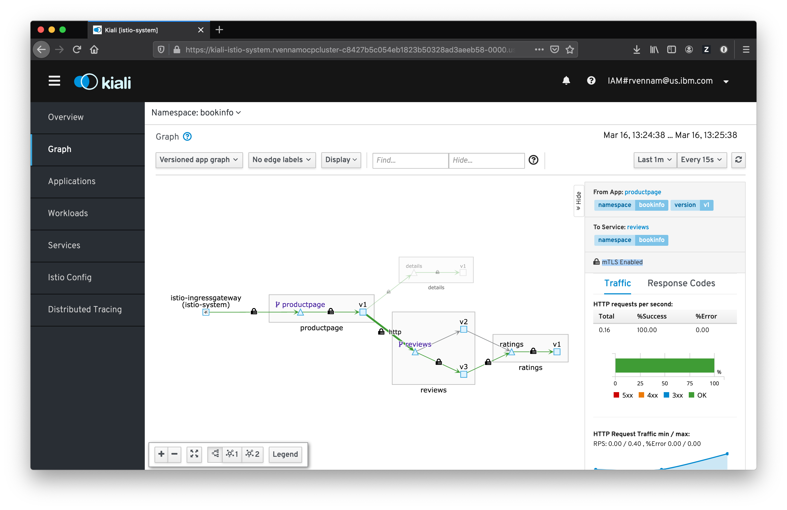

# Exercise 7 - Secure your services 

## Mutual authentication with Transport Layer Security (mTLS)

Istio can secure the communication between microservices without requiring application code changes. Security is provided by authenticating and encrypting communication paths within the cluster. This is becoming a common security and compliance requirement. Delegating communication security to Istio (as opposed to implementing TLS in each microservice), ensures that your application will be deployed with consistent and manageable security policies.

Istio Citadel is an optional part of Istio's control plane components. When enabled, it provides each Envoy sidecar proxy with a strong (cryptographic) identity, in the form of a certificate.
Identity is based on the microservice's service account and is independent of its specific network location, such as cluster or current IP address.
Envoys then use the certificates to identify each other and establish an authenticated and encrypted communication channel between them.

Citadel is responsible for:

* Providing each service with an identity representing its role.

* Providing a common trust root to allow Envoys to validate and authenticate each other.

* Providing a key management system, automating generation, distribution, and rotation of certificates and keys.

When an application microservice connects to another microservice, the communication is redirected through the client side and server side Envoys. The end-to-end communication path is:

* Local TCP connection (i.e., `localhost`, not reaching the "wire") between the application and Envoy (client- and server-side);

* Mutually authenticated and encrypted connection between Envoy proxies.

When Envoy proxies establish a connection, they exchange and validate certificates to confirm that each is indeed connected to a valid and expected peer. The established identities can later be used as basis for policy checks (e.g., access authorization).

## Configure mTLS between your pods

1.  To configure mTLS, we need to modify our previous destination rules to use ISTIO_MUTUAL. 

```shell
kubectl replace -f destination-rule-all-mtls.yaml
```

2. Send more traffic to your application. Everything should still continue to work as expected.

3. Launch Kiali again and go to the **Graph**

4. Under Display, select **Security**. Confirm your traffic is secure.




## Enable SSL for traffic coming in to your cluster (HTTPS)


### Create certs for Router to Ingress Gateway

1. Create a root certificate and private key to sign the certificate for your services:
    ```
    openssl req -x509 -sha256 -nodes -days 365 -newkey rsa:2048 -subj '/O=example Inc./CN=istio-system.svc' -keyout example.com.key -out example.com.crt
    ```
    example.com.crt and example.com.key files should be generated.

2. Create a certificate and a private key for istio-ingressgateway.istio-system.svc:

    ```
    openssl req -out ingGW.csr -newkey rsa:2048 -nodes -keyout ingGW.key -subj "/CN=istio-ingressgateway.istio-system.svc"
    openssl x509 -req -days 365 -CA example.com.crt -CAkey example.com.key -set_serial 0 -in ingGW.csr -out ./ingGW.crt
    ```
    ingGW.crt, ingGW.csr, and ingGW.key files should be generated.

3. Create a Kubernetes secret to hold the server’s certificate and private key. Use kubectl to create the secret istio-ingressgateway-certs in namespace istio-system.
    ```
    kubectl create -n istio-system secret tls istio-ingressgateway-certs --key ingGW.key --cert ingGW.crt
    ```

4. Delete the ingress gateway pod and force the ingress gateway pod to restart and reload key and certificate
    ```
    kubectl delete pod -l app=istio-ingressgateway -n istio-system
    ```


1. Launch the OpenShift console and choose the **istio-system** project
2. Under **Networking** -> **Routes**, click **Create Route**
3. Name: `istio-ingressgateway-secure`
4. Service: `istio-ingressgateway`
5. Target Port `80->8080`
6. Check `Secure Route`
7. TLS Termination: `Re-encrypt`
8. Insecure Traffic: `None`
9. Destination CA Certificate: Upload the `example.com.crt` file from the previous section
10. Click **Create**

Visit the new HTTPS route next to **istio-ingressgateway-secure**. Remember to add /productpage at the end of the URL!


## THANK YOU

Thank you so much for your time today!  You've done an excellent job making it through the material.

## Further Reading

* [Basic TLS/SSL Terminology](https://dzone.com/articles/tlsssl-terminology-and-basics)

* [TLS Handshake Explained](https://www.ibm.com/support/knowledgecenter/en/SSFKSJ_7.1.0/com.ibm.mq.doc/sy10660_.htm)

* [Istio Task](https://istio.io/docs/tasks/security/mutual-tls.html)

* [Istio Concept](https://istio.io/docs/concepts/security/mutual-tls.html)
