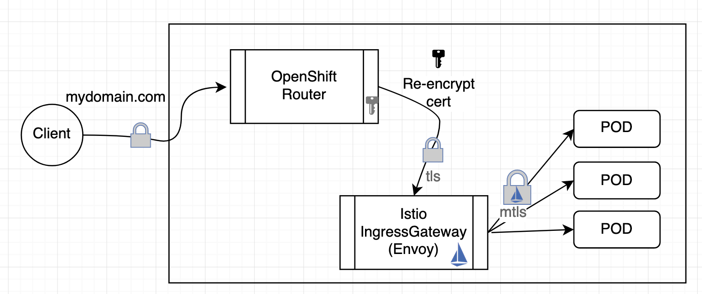
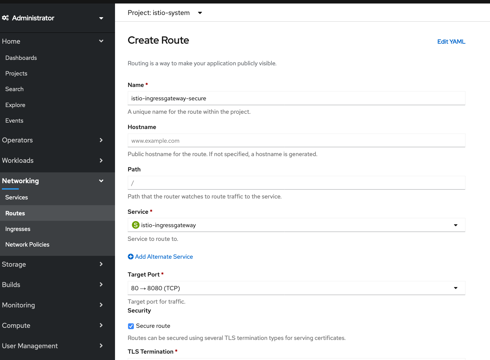

## Enable SSL for traffic coming in to your cluster (HTTPS)



### Create certs for Router to Ingress Gateway

1. Create a root certificate and private key to sign the certificate for your services:
    ```
    openssl req -x509 -sha256 -nodes -days 365 -newkey rsa:2048 -subj '/O=example Inc./CN=istio-system.svc' -keyout example.com.key -out example.com.crt
    ```
    example.com.crt and example.com.key files should be generated.

2. Create a certificate and a private key for istio-ingressgateway.istio-system.svc:
    ```
    openssl req -out ingGW.csr -newkey rsa:2048 -nodes -keyout ingGW.key -subj "/CN=istio-ingressgateway.istio-system.svc"
    openssl x509 -req -days 365 -CA example.com.crt -CAkey example.com.key -set_serial 0 -in ingGW.csr -out ./ingGW.crt
    ```
    ingGW.crt, ingGW.csr, and ingGW.key files should be generated.

3. Create a Kubernetes secret to hold the server’s certificate and private key. Use kubectl to create the secret istio-ingressgateway-certs in namespace istio-system.
    ```
    kubectl create -n istio-system secret tls istio-ingressgateway-certs --key ingGW.key --cert ingGW.crt
    ```

4. Delete the ingress gateway pod and force the ingress gateway pod to restart and reload key and certificate
    ```
    kubectl delete pod -l app=istio-ingressgateway -n istio-system
    ```

### Create a secure Route to the Ingress Gateway



1. Launch the OpenShift console and choose the **istio-system** project
2. Under **Networking** -> **Routes**, click **Create Route**
3. Name: `istio-ingressgateway-secure`
4. Service: `istio-ingressgateway`
5. Target Port `443->8443`
6. Check `Secure Route`
7. TLS Termination: `Re-encrypt`
8. Insecure Traffic: `None`
9. Destination CA Certificate: Upload the `example.com.crt` file from the previous section
10. Click **Create**

Visit the new HTTPS route next to **istio-ingressgateway-secure**. Remember to add /productpage at the end of the URL!

